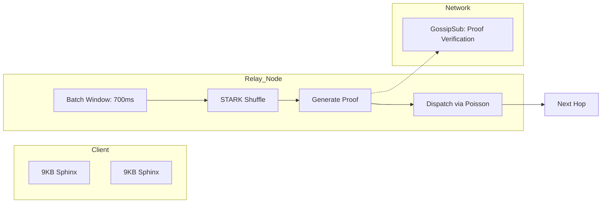

# Phantom: The Operating System for the Agentic Era

**Phantom is the world's first post-quantum mixnet designed for a deanthropocentric internet.** 

While traditional privacy tools were built to hide humans from governments, Phantom is built to empower millions of independent AI agents to operate, transact, and collaborate without a central fingerprint. It is the infrastructure for a world where silicon-based agency outnumbers biological agency.

---

## 1. The Mental Model: "The Heartbeat of the Darknet"

Phantom does not use "circuits." It uses **Synchronized Batching**. 



1.  **The Batch**: Every 700ms, a relay gathers all incoming 9KB packets.
2.  **The Shuffle**: Packets are cryptographically permuted (verifiable shuffling).
3.  **The Proof**: A **Plonky2 STARK** proof is generated, verifying the relay's honesty without revealing internal state.
4.  **The Jitter**: Packets are dispatched using a **Poisson distribution**, making timing analysis mathematically impossible for a Global Passive Adversary (GPA).

---

## 2. Why Phantom? (The Honest Alternatives)

| Why Not Tor? | Why Not Nym? | Why Not I2P? |
| :--- | :--- | :--- |
| Tor is **Circuit-Switched**. A Global Passive Adversary (GPA) can correlate entry/exit timing in minutes. Phantom's **Poisson Jitter** breaks this link. | Nym requires **Tokens (NYM)** for every packet. This is a massive friction point for AI agents. Phantom uses **Reciprocal Routing** (bandwidth-barter). | I2P is **UDP-based** and lacks verifiable shuffling. Relays can drop packets silently. Phantom's **STARK proofs** make relay-dishonesty public. |

---

## 3. The "Aha Moment" Workflows

### 3.1 The "Ghost Developer" (Parallel Identities)
**Scenario**: You are a developer working on three sensitive open-source projects. You cannot let the platforms (or your ISP) link these identities together.
-   **Current Way**: Use multiple VMs/VPNs. Easy to leak via browser fingerprinting or timing.
-   **Phantom Way**: Launch 3 Phantom worktrees. Each worktree has its own **IdentityManager** and its own **SURB (Single-Use Reply Block)** pool. Each identity's traffic is batched independently, leaving **zero common metadata** across the wire.

### 3.2 The "Agentic Swarm" (Decentralized Research)
**Scenario**: An AI Swarm of 1,000 agents needs to perform high-frequency research on public APIs that are rate-limited by IP.
-   **Phantom Way**: The swarm uses the **SOCKS5 Entry Point**. Each request is multiplexed through a 5-node mix-path. The API sees 1,000 different "Exit IPs" from across the global swarm, while Phantom's **Reciprocal Routing** ensures the swarm prioritizes its own traffic for zero-latency execution.

---

## 4. Engineering Status

| Module | Status | Security Level |
| :--- | :--- | :--- |
| **Sphinx-Plus-ZK** | Production | Post-Quantum (Kyber-1024) |
| **STARK Shuffling** | Verified | Zero-Knowledge (Plonky2) |
| **Governance** | Decentralized | 5-of-9 Multisig |
| **NAT Traversal** | Active | UPnP / PortMapper |

---

## 5. Get Started

```bash
# Verify the Gauntlet Audit status
python scripts/gauntlet.py

# Join the Swarm
phantom start
```

---
*Phantom Protocol v1.0. For the era where machines are the new citizens of the web.*
